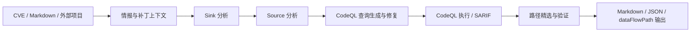

# PureAutoCodeQL

<div align="center">

[](LICENSE)
[](https://www.python.org/)
[](https://codeql.github.com/)
[](api/README.md)
[](https://github.com/astral-sh/uv)

**面向 CVE 研究与源码审计的多智能体 CodeQL 自动分析流水线。**

把漏洞情报、补丁上下文、Source/Sink 识别、CodeQL 查询生成、查询执行和路径精选串成一条可复用的分析流程，支持 Java、Python 与 C/C++ 项目。

[快速开始](#快速开始) · [能力概览](#能力概览) · [API 服务](#api-服务) · [安全说明](#安全说明) · [文档索引](#文档索引)

</div>

## 能力概览

PureAutoCodeQL 适合用来快速复盘 CVE、生成漏洞定制 CodeQL 查询、定位关键数据流路径，并把结果沉淀为结构化报告。

| 模块 | 作用 |
| --- | --- |
| CVE 情报分析 | 拉取并汇总 GHSA/NVD、补丁、输入文件等上下文 |
| Source/Sink 分析 | 结合 LLM、LSP 与源码上下文识别攻击入口和危险调用 |
| CodeQL 查询生成 | 自动生成、执行、修复并复跑漏洞定制查询 |
| 路径精选 | 从 SARIF/dataFlowPath 中筛选最有价值的候选路径 |
| 项目导入 | 支持 `src/`、`source_code/`、zip 源码包、patch/diff 同步与 CodeQL 建库 |
| HTTP API | 提供任务管理、项目管理与 SSE 流式事件，便于接入前端或平台 |

## 工作流



## 快速开始

### 环境准备

- Python 3.13+
- [uv](https://github.com/astral-sh/uv)
- [CodeQL CLI](https://github.com/github/codeql-cli-binaries)，并加入 `PATH`
- Node.js 18+ 与 npm，用于构建 MCP ripgrep 工具
- 可选：Docker，用于 C/C++ 项目的容器化建库兜底

### 安装依赖

```bash
git clone https://github.com/Fruit-Guardians/PureAutoCodeql.git
cd PureAutoCodeql

uv sync
```

构建 MCP ripgrep 工具：

```bash
# macOS / Linux
chmod +x scripts/build_mcp.sh
./scripts/build_mcp.sh

# Windows
scripts\build_mcp.bat
```

### 配置模型

复制密钥模板并填入自己的 API Key：

```bash
cp config/keys.example.toml config/keys.toml
```

内置提供商包括 `deepseek`、`siliconflow`、`zhipu`、`kimi`、`gemini`，也支持任意 OpenAI 兼容的自定义服务商。

```bash
# 查看可用提供商
uv run python Analyze.py --list-providers

# 使用指定提供商
uv run python Analyze.py --case CVE-2021-21985 --provider deepseek
```

命令行参数优先级高于环境变量和 `config/keys.toml`。更多配置方式见 [config/README.md](config/README.md)。

## 使用方式

### 分析已导入案例

```bash
uv run python Analyze.py --case CVE-2021-21985 --provider deepseek
```

新的子命令形式也可用，并会保持与旧参数形式等价：

```bash
uv run pure-auto-codeql analyze --case CVE-2021-21985 --provider deepseek
```

默认会展示 AI 思考过程；如需安静运行：

```bash
uv run python Analyze.py --case CVE-2021-21985 --no-stream
```

### 自动导入并分析外部项目

当 `--case` 传入的是目录路径时，系统会自动导入到 `projects/`、同步补丁并尝试创建 CodeQL 数据库。

```bash
uv run python Analyze.py --case "/path/to/CVE-2025-54381" \
  --provider deepseek \
  --refresh-intel
```

推荐的外部目录结构：

```text
CVE-XXXX-XXXX/
├── CVE-XXXX-XXXX.json
├── patch/
│   └── *.patch 或 *.diff
└── src/ 或 source_code/
    └── 源码目录或源码压缩包
```

### 仅导入项目

```bash
uv run python Analyze.py --import-project "/path/to/CVE-2025-54381" \
  --import-language java \
  --import-overwrite
```

C/C++ 项目可以传入构建命令或脚本：

```bash
uv run python Analyze.py --import-project "/path/to/CVE-XXXX" \
  --import-language cpp \
  --import-build-command "make -j4"
```

### 从 Markdown 生成 CodeQL

```bash
uv run python Analyze.py --md-file vulnerability.md \
  --database-path /path/to/codeql-db \
  --language java \
  --provider deepseek
```

也可以先基于漏洞描述和源码生成 Source 分析报告：

```bash
uv run python Analyze.py --md-file vulnerability.md \
  --src-path /path/to/source \
  --language python \
  --output source_report.md
```

### 常用命令

```bash
uv run python Analyze.py --doctor
uv run pure-auto-codeql doctor
uv run python Analyze.py --list
uv run python Analyze.py --validate CVE-2021-21985
uv run python Analyze.py --list-providers
uv run python Analyze.py --list-models
```

`--doctor` 会检查 Python、uv、CodeQL CLI、Node.js、npm、MCP 构建产物、`keys.toml`、`JAVA_HOME` 和可用 LLM Provider，适合在新机器或 CI 失败时快速定位环境问题。

## 输出结果

默认输出会写入按案例与时间戳组织的目录：

```text
output/
└── CVE-XXXX-XXXX/
    └── YYYYMMDD-HHMMSS/
        ├── summary.md
        ├── sarif/
        │   └── codeql-run.sarif
        ├── codeql/
        │   └── all-paths-raw.json
        └── path-selection/
            ├── report.md
            ├── selection.json
            └── dataflow.json
```

核心文件说明：

| 文件 | 用途 |
| --- | --- |
| `summary.md` | 完整分析报告，包含 CVE、Source、Sink、查询生成与执行摘要 |
| `sarif/codeql-run.sarif` | CodeQL 原始 SARIF 输出 |
| `codeql/all-paths-raw.json` | 未筛选的原始 dataFlowPath |
| `path-selection/report.md` | 人类可读的路径精选说明 |
| `path-selection/selection.json` | 路径精选完整元数据 |
| `path-selection/dataflow.json` | 精简后的最佳路径结果，适合二次集成 |

## API 服务

启动本地 API：

```bash
uv run uvicorn api.server:app --host 127.0.0.1 --port 8000
```

或使用 CLI 子命令：

```bash
uv run pure-auto-codeql serve --host 127.0.0.1 --port 8000
```

也可以使用脚本：

```bash
./scripts/start_api_server.sh
```

默认安全策略：

- API 仅监听 `127.0.0.1`
- 项目导入只允许 `API_IMPORT_SOURCES_DIR` 指向的目录，默认是仓库内 `imports/`
- 请求体中的 C/C++ 构建命令默认禁用
- 设置 `API_AUTH_TOKEN` 后，所有接口需要 Bearer Token

示例：

```bash
export API_AUTH_TOKEN="change-me"
uv run uvicorn api.server:app --host 127.0.0.1 --port 8000

curl -H "Authorization: Bearer change-me" http://127.0.0.1:8000/api/projects
```

如需开放远程导入或 API 构建命令，请显式设置：

```bash
export API_ALLOW_EXTERNAL_IMPORT_PATHS=true
export API_ALLOW_API_BUILD_COMMANDS=true
```

详细接口和 SSE 事件见 [api/README.md](api/README.md) 与 [api/SSE_REFERENCE.md](api/SSE_REFERENCE.md)。

## 项目结构

```text
PureAutoCodeQL/
├── Analyze.py / config.py     # 兼容入口 shim
├── pure_auto_codeql/          # 规范运行时命名空间
│   ├── agents/ application/ cli/ configuration.py paths.py
│   ├── api/ core/ services/ utils/ tools/ prompts/ information/
│   └── …
├── api/ core/ services/ utils/ tools/ prompts/ Information/
│                              # 顶层 re-export shim（兼容旧 import）
├── config/                    # LLM Provider 实现 + keys 模板
├── docs/                      # 使用指南（含 docs/cpp/）
├── resources/                 # CodeQL 模板、知识库与扩展库
├── scripts/                   # API 启动、MCP 构建与 smoke
├── tools/mcp_ripgrep/         # Node MCP 构建产物（仍在顶层 tools/）
├── projects/ examples/ docker/ openspec/ test/
└── README / pyproject.toml / …
```

## 文档索引

| 文档 | 内容 |
| --- | --- |
| [config/README.md](config/README.md) | LLM Provider、`keys.toml` 与自定义服务商 |
| [api/README.md](api/README.md) | API 启动、路由与开发说明 |
| [api/SSE_REFERENCE.md](api/SSE_REFERENCE.md) | SSE 流式事件参考 |
| [docs/package_architecture.md](docs/package_architecture.md) | 包命名空间迁移、兼容导入与架构检查 |
| [docs/auto_import_quickstart.md](docs/auto_import_quickstart.md) | 外部 CVE 项目自动导入 |
| [docs/output_files_guide.md](docs/output_files_guide.md) | 输出文件结构和用途 |
| [docs/path_selection_run_guide.md](docs/path_selection_run_guide.md) | 路径精选模块运行说明 |
| [docs/extra_input_files_simple.md](docs/extra_input_files_simple.md) | `inputs/` 额外上下文文件 |
| [docs/cpp/CPP_TWO_STEP_BUILD_GUIDE.md](docs/cpp/CPP_TWO_STEP_BUILD_GUIDE.md) | C/C++ 两步走建库策略 |
| [docs/archive/](docs/archive/) | 历史设计方案、诊断笔记和阶段性总结 |

## 测试

```bash
uv run pytest -q
uv lock --check
uv run python -m compileall -q Analyze.py api core services utils pure_auto_codeql tools
```

## 配置导入约定

运行时代码推荐从 `pure_auto_codeql.configuration` 导入 LLM 配置：

```python
from pure_auto_codeql.configuration import get_llm_config, LLMRole
```

历史脚本中的 `from config import ...` 和 `python config.py ...` 仍保持兼容。

## 安全说明

- 不要提交真实密钥。`config/keys*.toml` 已被忽略，仓库只保留 `config/keys.example.toml` 模板。
- 如果历史提交中曾经暴露过真实密钥，请立即轮换或吊销，并按需清理 Git 历史。
- 对外暴露 API 时请设置 `API_AUTH_TOKEN`，并谨慎启用外部路径导入和 API 构建命令。
- 导入第三方源码和补丁时请优先在隔离环境运行，尤其是需要执行构建脚本的 C/C++ 项目。

漏洞报告与披露流程见 [SECURITY.md](SECURITY.md)。

## 贡献

欢迎提交 Issue 和 Pull Request。开始前建议先阅读 [CONTRIBUTING.md](CONTRIBUTING.md)，并尽量附上可复现输入、运行命令和关键输出。

## 许可证

本项目采用 [MIT License](LICENSE)。
