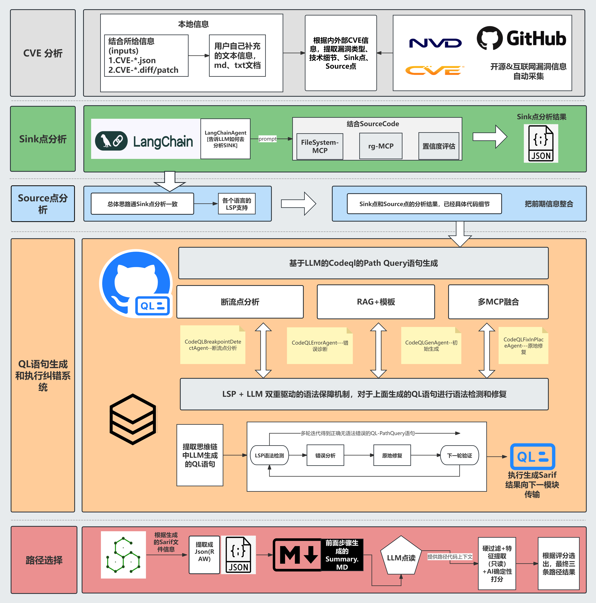
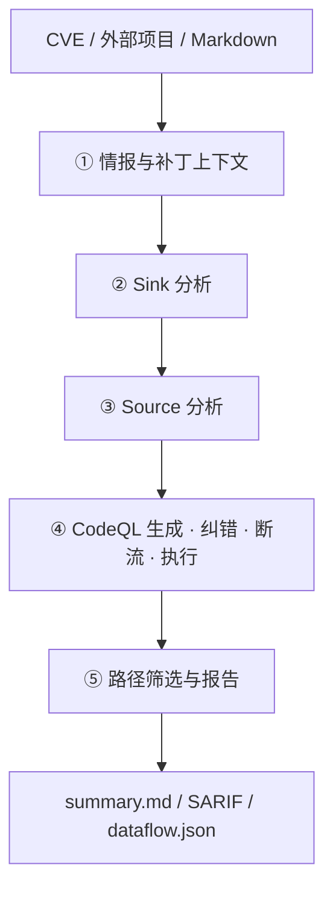

# PureAutoCodeQL

<div align="center">

[](LICENSE)
[](https://github.com/Fruit-Guardians/PureAutoCodeql/actions/workflows/ci.yml)
[](https://www.python.org/)
[](https://codeql.github.com/)
[](pure_auto_codeql/api/README.md)
[](https://github.com/astral-sh/uv)
[](#它做什么)
[](README.md)

**面向 CVE 复盘与源码审计的多智能体 CodeQL 自动化系统**

从漏洞情报和补丁出发，自动定位 Source/Sink、生成并修复 CodeQL 查询，
执行路径分析，最后留下可复核的 SARIF、QL、精选路径和运行清单。

🏆 *6th Place — 2025 Qiangwang Cup Industry-Specific Competition*

<br/>

[快速开始](#快速开始) ·
[它做什么](#它做什么) ·
[系统架构](#系统架构) ·
[使用方式](#使用方式) ·
[输出结果](#输出结果) ·
[API](#api-服务) ·
[文档](#文档)

</div>

---

## 它做什么

CVE 复盘或审计通常要反复处理几件事：阅读 advisory 和补丁、在源码中寻找入口与
危险点、手写并调试 CodeQL，再从大量结果中筛出真正相关的路径。

PureAutoCodeQL 将这些工作放进同一条可配置流水线，输出结构化结果和可继续维护的
查询产物。

| 分析任务 | 系统产出 |
| --- | --- |
| 弄清这个 CVE 在说什么 | 汇总本地 JSON / patch / 补充材料，可选拉取 NVD、GHSA |
| 定位危险调用与用户可控输入 | Sink / Source Agent + 源码检索 + 语言 LSP |
| 得到可执行的 CodeQL | 语言模板与内部知识库生成 Path Query，LSP 校验并迭代修复 |
| 查询为空或数据流断掉 | 断流点分析，补 `isAdditionalFlowStep` 后重跑 |
| 路径太多、噪声大 | 硬过滤 + 特征打分 + LLM 只读解释，收敛高质量路径 |
| 接入平台或前端 | API/Worker 分离，PostgreSQL 保存状态，Redis Streams 分发任务与事件 |
| 复查一次完整运行 | `manifest.json` 记录配置、步骤、版本、耗时、警告和产物哈希 |

适用于安全研究、漏洞复现、CodeQL 规则沉淀，以及需要保留结构化证据的源码审计。

---

## 系统架构

<p align="center">
  
</p>

<details>
<summary><b>阶段一览（点击展开）</b></summary>

<br/>

| # | 阶段 | 输入 | 输出 |
| --- | --- | --- | --- |
| 1 | CVE 分析 | 案例目录、`inputs/`、可选在线情报 | 漏洞摘要、Source/Sink 线索 |
| 2 | Sink 分析 | CVE 报告 + 源码 | 危险点 / API 报告 |
| 3 | Source 分析 | Sink 结果 + 源码 + LSP | 用户可控入口与路径摘要 |
| 4 | QL 生成与执行 | 上下文 + 语言知识库 | 可执行 QL、SARIF、原始 dataflow |
| 5 | 路径选择 | SARIF + 前期摘要 | 精选路径与 `summary.md` |



多 Agent（LangChain / LangGraph）协作：源码侧经 MCP（文件系统、ripgrep）与语言服务器按需取上下文；CodeQL 侧用内部知识库约束生成，并用 CodeQL LSP 做语法闭环。支持 DeepSeek 等 OpenAI 兼容模型。

</details>

---

## 快速开始

### 1. 环境

| 依赖 | 说明 |
| --- | --- |
| Python **3.13+** | 运行时 |
| [uv](https://github.com/astral-sh/uv) | 依赖与命令入口 |
| [CodeQL CLI](https://docs.github.com/code-security/code-scanning/creating-an-advanced-setup-for-code-scanning/codeql-cli) | bootstrap 会安装并校验锁定版本的完整 Bundle |
| Node.js 18+ / npm | 构建 MCP ripgrep |
| Docker（可选） | C/C++ 建库兜底 |

### 2. 安装

```bash
git clone https://github.com/Fruit-Guardians/PureAutoCodeql.git
cd PureAutoCodeql
chmod +x scripts/bootstrap.sh
./scripts/bootstrap.sh
```

该脚本会安装锁定的 Python 依赖、filesystem/ripgrep MCP、LSP-MCP
桥接器、CodeQL CLI，并运行源码 LSP 与 CodeQL 查询 LSP 的真实冒烟检查；
重复执行是安全的，不会覆盖已有 `config/keys.toml`。

Windows 及逐项安装说明见
[环境搭建指南](docs/environment_setup.md)。

### 3. 配置模型

```bash
cp config/keys.example.toml config/keys.toml
# 编辑 keys.toml，填入 API Key
```

内置：`deepseek` · `siliconflow` · `zhipu` · `kimi` · `gemini`  
也支持任意 OpenAI 兼容服务商 → [config/README.md](config/README.md)

### 4. 跑起来

```bash
uv run python Analyze.py --list-providers
uv run python Analyze.py --case CVE-2021-21985 --provider deepseek
```

新环境建议先自检：

```bash
uv run pure-auto-codeql doctor
uv run python -m pure_auto_codeql.tools.smoke_codeql
```

---

## 使用方式

### 分析已导入案例

```bash
uv run python Analyze.py --case CVE-2021-21985 --provider deepseek

# 等价入口
uv run pure-auto-codeql analyze --case CVE-2021-21985 --provider deepseek

# 安静模式（不流式展示思考过程）
uv run python Analyze.py --case CVE-2021-21985 --no-stream
```

### 导入外部项目并分析

`--case` 为**目录路径**时，会导入到 `projects/`、同步补丁并尝试建库：

```bash
uv run python Analyze.py --case "/path/to/CVE-2025-54381" \
  --provider deepseek \
  --refresh-intel
```

推荐外部目录结构：

```text
CVE-XXXX-XXXX/
├── CVE-XXXX-XXXX.json      # 漏洞描述（可选，缺失时可在线补全）
├── patch/                  # *.patch / *.diff
└── src/ 或 source_code/    # 源码目录或压缩包
```

### 仅导入

```bash
uv run python Analyze.py --import-project "/path/to/CVE-2025-54381" \
  --import-language java \
  --import-overwrite
```

C/C++ 可附带构建命令：

```bash
uv run python Analyze.py --import-project "/path/to/CVE-XXXX" \
  --import-language cpp \
  --import-build-command "make -j4"
```

### 从 Markdown 起步

```bash
# 已有 CodeQL 数据库：生成并执行查询
uv run python Analyze.py --md-file vulnerability.md \
  --database-path /path/to/codeql-db \
  --language java \
  --provider deepseek

# 先出 Source 分析报告
uv run python Analyze.py --md-file vulnerability.md \
  --src-path /path/to/source \
  --language python \
  --output source_report.md
```

### 常用命令

```bash
uv run python Analyze.py --doctor                 # 环境诊断
uv run pure-auto-codeql doctor
uv run python Analyze.py --list                   # 列出案例
uv run python Analyze.py --validate CVE-2021-21985
uv run python Analyze.py --list-providers
uv run python Analyze.py --list-models
```

---

## 输出结果

默认写入 `output/<案例>/<时间戳>/`：

```text
output/
└── CVE-XXXX-XXXX/
    └── YYYYMMDD-HHMMSS/
        ├── summary.md                  # 完整分析报告
        ├── manifest.json               # 配置、版本、步骤状态与产物哈希
        ├── sarif/
        │   └── codeql-run.sarif        # CodeQL 原始结果
        ├── codeql/
        │   └── all-paths-raw.json      # 未筛选 dataflow 路径
        └── path-selection/
            ├── report.md               # 精选说明
            ├── selection.json          # 精选元数据
            └── dataflow.json           # 精简路径（便于二次集成）
```

详见 [docs/output_files_guide.md](docs/output_files_guide.md)。

---

## API 服务

```bash
# 推荐：完整持久化 API/Worker 环境
export API_AUTH_TOKEN="change-me"
docker compose up --build

# 单进程兼容模式
uv run uvicorn pure_auto_codeql.api.server:app --host 127.0.0.1 --port 8000

# 或
uv run pure-auto-codeql serve --host 127.0.0.1 --port 8000
./scripts/start_api_server.sh
```

| 默认策略 | 说明 |
| --- | --- |
| 监听地址 | 仅 `127.0.0.1` |
| 导入范围 | `API_IMPORT_SOURCES_DIR`（默认仓库内 `imports/`） |
| 构建命令 | 请求体中默认禁用 |
| 鉴权 | 非回环监听强制 `API_AUTH_TOKEN`；支持哈希与轮换 |
| 持久化 | PostgreSQL 权威状态，Redis Streams 任务与事件 |

```bash
export API_AUTH_TOKEN="change-me"
curl -H "Authorization: Bearer change-me" http://127.0.0.1:8000/api/v1/projects
```

更多： [API README](pure_auto_codeql/api/README.md) · [SSE 参考](pure_auto_codeql/api/SSE_REFERENCE.md) · [部署](docs/deployment.md)

---

## 项目结构

```text
PureAutoCodeQL/
├── Analyze.py / config.py      # CLI / 配置兼容入口
├── pure_auto_codeql/           # 运行时包
│   ├── agents/                 # CVE · Sink · Source · CodeQL 多智能体
│   ├── application/            # CLI 与 API 共享工作流
│   ├── api/                    # FastAPI + SSE
│   ├── platform/ · worker.py   # PostgreSQL/Redis 持久化任务平台
│   ├── cli/ · core/ · services/ · tools/
│   ├── information/ · prompts/ · utils/
│   ├── config/                 # LLM 配置实现
│   ├── configuration.py        # 推荐配置门面
│   └── paths.py
├── config/                     # keys.example.toml（本地 keys 不入库）
├── tools/mcp_ripgrep/          # ripgrep MCP
├── docs/images/                # 架构图等
├── resources/ · scripts/ · docker/
├── projects/case-template/ · examples/ · test/
└── pyproject.toml
```

应用代码中推荐：

```python
from pure_auto_codeql.configuration import get_llm_config, LLMRole
```

包布局说明见 [docs/package_architecture.md](docs/package_architecture.md)。

---

## 文档

| 文档 | 内容 |
| --- | --- |
| [config/README.md](config/README.md) | Provider 与 `keys.toml` |
| [pure_auto_codeql/api/README.md](pure_auto_codeql/api/README.md) | API 启动与路由 |
| [pure_auto_codeql/api/SSE_REFERENCE.md](pure_auto_codeql/api/SSE_REFERENCE.md) | SSE 事件 |
| [docs/auto_import_quickstart.md](docs/auto_import_quickstart.md) | 外部项目导入 |
| [docs/output_files_guide.md](docs/output_files_guide.md) | 输出文件 |
| [docs/path_selection_run_guide.md](docs/path_selection_run_guide.md) | 路径精选 |
| [docs/codeql_breakpoint_detection_README.md](docs/codeql_breakpoint_detection_README.md) | 断流点检测 |
| [docs/cpp/CPP_TWO_STEP_BUILD_GUIDE.md](docs/cpp/CPP_TWO_STEP_BUILD_GUIDE.md) | C/C++ 建库 |
| [docs/codeql_lsp_troubleshooting.md](docs/codeql_lsp_troubleshooting.md) | CodeQL LSP 排查 |
| [docs/package_architecture.md](docs/package_architecture.md) | 包结构 |
| [docs/deployment.md](docs/deployment.md) | Compose 与 Kubernetes 部署 |
| [docs/language_capabilities.md](docs/language_capabilities.md) | 三语言能力矩阵 |
| [docs/api_v1_migration.md](docs/api_v1_migration.md) | API v1 迁移 |

---

## 开发与测试

```bash
uv run pytest -q
uv lock --check
uv run ruff check pure_auto_codeql test migrations
uv run pyright
uv run python -m compileall -q Analyze.py pure_auto_codeql
```

欢迎 Issue / PR，见 [CONTRIBUTING.md](CONTRIBUTING.md)。

---

## 安全说明

- 不要提交真实密钥；仓库只保留 `config/keys.example.toml`。
- 若密钥曾进入历史提交，请立即轮换并视情况清理 Git 历史。
- 对外暴露 API 时请设置 `API_AUTH_TOKEN`，谨慎开启外部导入与构建命令。
- 分析第三方源码（尤其执行构建脚本）时建议在隔离环境中运行。

漏洞披露流程见 [SECURITY.md](SECURITY.md)。

---

## 许可证

[MIT License](LICENSE)
